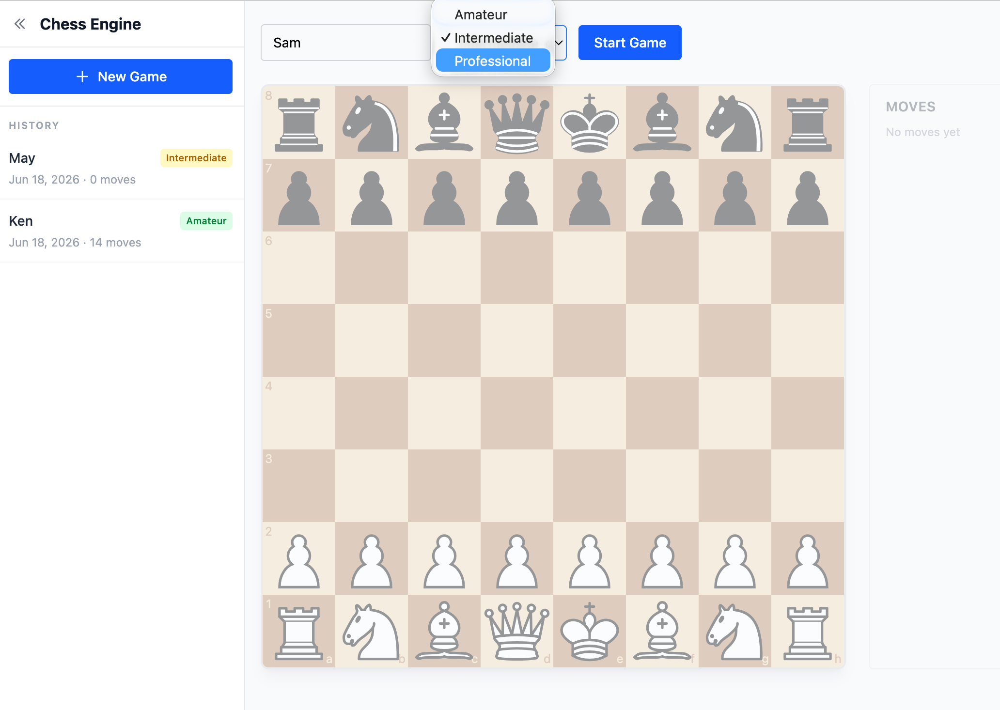
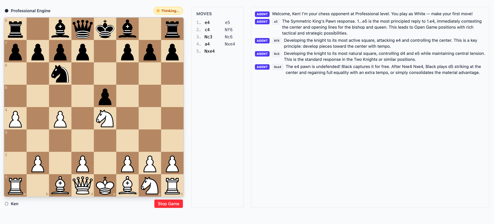
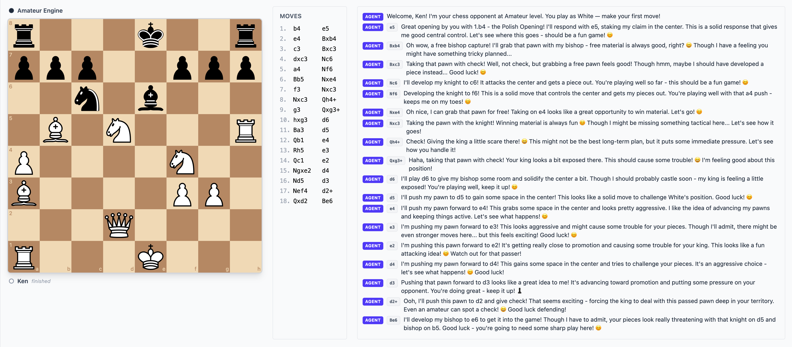

# Building a Stateful LLM Application: Chess App

Chess is a natural fit for exploring stateful LLM patterns. Every move depends on everything that came before it — the LLM needs the full game history to understand the current position and play intelligently. This is the core challenge: LLMs are stateless by nature, but the application is not.

This article walks through the implementation of a chess app where the user plays against Claude acting as an AI engine. You play as White via a drag-and-drop board. After each move, Claude picks a legal reply and writes a natural-language comment in the chat panel. Both the move quality and the commentary style adapt to the selected engine level — Amateur, Intermediate, or Professional.

The focus is on the patterns that make this work in practice: a two-tier state model (Redis + PostgreSQL), fire-and-forget decoupling, a single LLM call that produces both a structured move and free-form commentary, and client-side ply navigation over a flat move array.



*The setup screen: history sidebar on the left, name and engine level inputs at the top, greyed-out board until the game starts.*

---

## Architecture Overview

```
Browser (React + Vite)
    │  drags piece → POST /api/game/{id}/move
    │  polls GET /api/game/{id} every 2s
    ▼
Backend (NestJS)              ──── PostgreSQL (persistence)
    │  fire-and-forget POST         Redis (live game state)
    ▼                               ▲
AI Engine (FastAPI + LangGraph) ────┘
    │  replays history with python-chess
    │  invokes Claude to pick reply
    └── writes engine move to Redis
```

**Redis is the shared live-state channel.** The backend fires the engine request without waiting for it to finish, so the HTTP response returns in milliseconds. The frontend polls every two seconds and picks up the engine's move as soon as it lands in Redis.

**PostgreSQL is the persistent store.** When the user stops a game, the flat `GameMove[]` array is written to the `moves` column and the Redis key is deleted. History reads come from PostgreSQL; live reads come from Redis.

---

## Tech Stack

| Layer | Technology |
|-------|-----------|
| Frontend | React 19, Vite, Tailwind CSS, react-chessboard, chess.js |
| Backend | NestJS 11, TypeORM, ioredis |
| AI Engine | FastAPI, LangGraph, LangChain Anthropic, python-chess |
| LLM | Claude (claude-sonnet-4-6) |
| Storage | PostgreSQL (persistence), Redis (live state) |
| Infrastructure | Docker Compose |

---

## Step 1 — Design the Move Data Model

Every event in the game is a `GameMove`. The flat array is the single source of truth for both the board and the chat panel:

```typescript
interface GameMove {
  actor: 'user' | 'agent'
  order: number       // move pair number; 0 = greeting
  notation: string    // SAN notation; empty for greeting and game-over messages
  message: string     // engine comment or error text
}
```

User and engine responses to the same move share the same `order` number. This makes the display table trivial to build — group by `order`, render white (user) and black (engine) side by side:

```
1.  b4    e5
2.  e4    Bxb4
3.  c3    Bxc3
```

The greeting uses `order: 0` with an empty `notation`. Game-over messages also use an empty `notation` on the engine side. Filtering `notation && order > 0` gives the chess-move list for board replay — the greeting and terminal messages never appear on the board.

The `message` field on each engine row is what appears in the chat panel alongside a notation badge:

> **Engine** `Bxb4` Oh wow, a free bishop capture! I'll grab that pawn — free material is always good, right? 😄 Though I have a feeling you might have something tricky planned...

Storing everything as `GameMove` means the data is self-contained — no separate chat table, no joined queries. The full game, including every commentary message, lives in a single `jsonb` column.

---

## Step 2 — Two-Tier State: Redis and PostgreSQL

The application maintains game state in two places with distinct roles.

**Redis holds live game state.** Each key `game:{uuid}` contains the full `GameInterface` as JSON. Both the backend (move recording) and the AI Engine (engine response) read and write this key. It is the communication channel between the two services.

**PostgreSQL persists completed games.** When the user stops a game, the backend loads the `GameInterface` from Redis, writes the full `moves` array to the `games` table, and deletes the Redis key:

```typescript
async stopGame(id: string): Promise<{ stopped: true }> {
  const game = await this.redisService.getJson<GameInterface>(this.redisKey(id));
  if (!game) throw new NotFoundException(`Game ${id} not found`);

  await this.gameRepo.save({
    uuid: id,
    userName: game.userName,
    engineLevel: game.engineLevel,
    moves: game.moves,
    startedAt: game.startedAt,
  });

  await this.redisService.del(this.redisKey(id));
  return { stopped: true };
}
```

When the frontend loads a history game, `GET /api/game/:id` misses Redis and falls back to PostgreSQL, returning the game with `status: 'stopped'`:

```typescript
async getGame(id: string): Promise<GameInterface> {
  const cached = await this.redisService.getJson<GameInterface>(this.redisKey(id));
  if (cached) return cached;

  const entity = await this.gameRepo.findOne({ where: { uuid: id } });
  if (!entity) throw new NotFoundException(`Game ${id} not found`);

  return {
    id: entity.uuid,
    userName: entity.userName,
    engineLevel: entity.engineLevel as EngineLevel,
    moves: entity.moves as unknown as GameMove[],
    status: GameStatus.stopped,
    startedAt: entity.startedAt,
  };
}
```

The `status: 'stopped'` flag drives the entire history-view UI: read-only board, interactive move list, visible chat without input, hidden Stop button. No separate mode flag is needed — the game status is the mode.

---

## Step 3 — Decouple the Engine from the API Layer

Running the AI Engine synchronously inside the HTTP request would hold the connection open for the full LLM round-trip — 1–5 seconds per move. The solution is **fire-and-forget**: the backend appends the user's move to Redis and returns `202 Accepted` immediately, while the engine runs in the background.

```typescript
// NestJS AgentService
notifyMove(gameId: string, move: { actor: string; order: number; notation: string }): void {
  this.httpService
    .post(`${this.aiEngineUrl}/api/game/move`, {
      game_uuid: gameId,
      actor: move.actor,
      order: move.order,
      notation: move.notation,
    })
    .subscribe({
      error: (err: unknown) => {
        this.logger.error(`Engine call failed for game ${gameId}: ${err}`);
      },
    });
}
```

No `await`. The Observable is subscribed to only for its error side-effect. The HTTP response to the frontend has already been sent by the time this resolves.

The same pattern fires on game creation (`order: 0`, empty notation) so the engine can send a greeting before the user makes any move.

**Redis over WebSockets.** A 2-second poll interval is imperceptible for a chess game where the engine takes several seconds to respond. Redis with polling is simpler to operate, trivially debuggable (`redis-cli get game:{uuid}`), and requires no sticky sessions.

---

## Step 4 — One LLM Call, Two Outputs

A chess engine does not need external tools. `python-chess` provides the board state and the complete list of legal moves in standard algebraic notation. But the LLM is not just picking a move — it is also writing a comment about that move in a tone calibrated to the engine level. Both happen in a single prompt invocation.

The LLM receives the full board context and produces a single JSON response:

```python
_SYSTEM_TEMPLATE = """You are a chess engine. Your engine level is: {level}.

Current board position (FEN): {fen}
Legal moves available: {legal_moves}

You MUST choose exactly one move from the legal moves list above.

Engine level behavior:
- Amateur: Play suboptimally, make occasional blunders, be encouraging and friendly.
- Intermediate: Play reasonably well, mix solid moves with occasional errors, be conversational.
- Professional: Play like a strong engine, choose the best strategic or tactical move, be concise and analytical.

Respond with a JSON object only:
{{"notation": "<one_move_from_legal_moves>", "message": "<brief comment about your move>"}}"""
```

Move quality and commentary voice both shift with `engine_level` from the same prompt. Here is what the Amateur engine produced across several consecutive moves in a real game (Ken playing the Polish Opening, 1.b4):

```
User:  b4    →  Engine: e5    — "Great opening with 1.b4 - the Polish Opening!
                                  I'll respond with e5. Should be a fun game! 😊"

User:  e4    →  Engine: Bxb4  — "Oh wow, a free bishop capture! Free material
                                  is always good, right? 😄 Though I have a feeling
                                  you might have something tricky planned..."

User:  c3    →  Engine: Bxc3  — "Taking that pawn! Though hmm, maybe I should
                                  have developed a piece instead... Good luck! 😊"

User:  g3    →  Engine: Qxg3+ — "Taking that pawn with check! Your king looks a bit
                                  exposed. I'm feeling good about this position! 😄"
```

The Amateur narrates its own reasoning — admitting uncertainty, celebrating material grabs, noticing threats belatedly. A Professional produces the same JSON structure but with terse, precise analysis. The engine level instruction shapes both outputs simultaneously.

Combining move selection and commentary in one call avoids two round-trips and keeps the instruction coherent — splitting them would require the second call to know what the first decided.

The response is parsed as JSON. If parsing fails or the chosen notation is not in the legal moves list, the service falls back to the first legal move — the game continues regardless of what the LLM returns:

```python
if agent_notation not in legal_moves:
    self._logger.warning(
        "LLM chose illegal move '%s', falling back to first legal move", agent_notation
    )
    agent_notation = legal_moves[0]
```



*A Professional-level game mid-play. The amber "Thinking…" badge is visible while Claude processes. The chat shows analytical commentary — opening theory and strategic ideas rather than move narration.*

---

## Step 5 — The LangGraph Graph

The engine logic uses LangGraph with a single node — no tool nodes needed because `python-chess` provides the legal moves directly:

```python
class AgentGraph:
    def build(self):
        agent = Agent()
        graph = StateGraph(AgentState)
        graph.add_node("agent", agent.invoke)
        graph.add_edge(START, "agent")
        graph.add_edge("agent", END)
        return graph.compile()
```

`AgentState` extends LangGraph's built-in `MessagesState` with chess-specific fields:

```python
class AgentState(MessagesState):
    fen: str
    legal_moves: list[str]
    engine_level: str
    notation: str    # output: engine's chosen move
    message: str     # output: engine's commentary
```

`fen`, `legal_moves`, and `engine_level` are set by `GameService` before the graph runs. `notation` and `message` are the two outputs written by the agent node and stored together in the same `GameMove` record.

The value of using LangGraph here — even for a single node — is extensibility. Adding an opening book lookup or endgame tablebase query later requires one new node, not a restructure.

---

## Step 6 — Validate Moves with python-chess

`python-chess` is the authoritative source of board truth. The AI Engine replays every prior move to rebuild the board before each decision:

```python
board = chess.Board()
for move in game.moves:
    if not move.notation:
        continue
    if move.actor == Actor.user and move.order == request.order:
        continue  # will validate below
    try:
        board.push_san(move.notation)
    except Exception:
        pass
```

The current user move is skipped during replay because the backend appended it to Redis before the engine received the request — but it has not been validated yet. It gets validated separately:

```python
if request.actor == Actor.user:
    try:
        board.push_san(request.notation)
    except (ValueError, chess.IllegalMoveError, chess.InvalidMoveError, chess.AmbiguousMoveError):
        self._update_move_message(game, request.order, Actor.user, "That move is not legal. Try again!")
        await self._redis.set(key, game.model_dump_json())
        return
```

If the move is illegal, the service writes an error message onto the move and returns without invoking the LLM. The frontend picks it up on the next poll and shows the error in the chat panel.

After the user's move is pushed, the engine checks for terminal states before asking Claude for a reply:

```python
if board.is_game_over():
    await self._handle_game_over(key, game, board, request.order)
    return

legal_moves = [board.san(m) for m in board.legal_moves]
```

`board.legal_moves` is the full legal move generator; `board.san(m)` converts each `Move` object to the same SAN format the LLM is asked to produce — keeping the format consistent in both directions.

Replaying the full move history on every engine call is safe because games are short and SAN moves are deterministic. The board object is rebuilt fresh each time from the stored move array.

---

## Step 7 — Build FEN from the Move Array on the Client

The frontend never stores the board position directly. It stores the raw `GameMove[]` from the API and derives the FEN on demand using `chess.js`:

```typescript
function buildFen(moves: GameMove[]): string {
  const chess = new Chess()
  for (const move of moves) {
    if (!move.notation) continue
    try {
      chess.move(move.notation)
    } catch {
      break
    }
  }
  return chess.fen()
}
```

`Chess.move()` accepts SAN notation and updates the internal board state. The FEN is passed to `react-chessboard` as `position`. Whenever the move array changes on a new poll, the FEN is recomputed and the board re-renders.

Storing FEN alongside moves would create a secondary truth that can diverge. Deriving it from the move list is cheap (games have at most ~100 moves) and means the board is always consistent with the move record.

### Ply Navigation in History View

When the user clicks a move in a completed game's move list, the board shows the position at that ply — not the final position. The frontend tracks a `selectedPly` index:

```typescript
const chessMoves = allMoves.filter((m) => m.notation && m.order > 0)
const boardMoves = selectedPly !== null
  ? chessMoves.slice(0, selectedPly + 1)
  : allMoves
```

`chessMoves` is the filtered list of notation-only moves in play order. Slicing to `selectedPly + 1` gives the board position at that point; the FEN is derived from that slice.

The `MoveList` component assigns a `plyIndex` to each half-move as it builds the display pairs, and each white and black cell is a `<button>` that calls `onSelectPly(plyIndex)`. Ply navigation is a pure client-side operation — no round-trips. The full move array is already in memory from the initial game load.



*The Amateur-level Polish Opening game — the same data as `moves.json`. The move list and chat panel scroll together; every engine entry has a corresponding commentary line tagged with a notation badge.*

---

## Step 8 — Centralise Dependency Injection

The AI Engine has three wired dependencies: the compiled LangGraph, the Redis client, and `GameService`. A `Container` class owns all construction using `@cached_property` as the singleton mechanism:

```python
class Container:
    @cached_property
    def graph(self):
        return AgentGraph().build()

    @cached_property
    def redis(self):
        return RedisClient().get()

    @cached_property
    def game_service(self) -> GameService:
        return GameService(
            graph=self.graph,
            redis=self.redis,
            logger=logging.getLogger("game_service"),
        )

container = Container()
```

`GameService` receives its dependencies through the constructor and never imports `container` directly. The FastAPI router resolves from the container module:

```python
@router.post("/game/move")
async def move(request: MoveRequest):
    await container.game_service.handle(request)
```

---

## Key Design Decisions

**Stateful LLM via full history replay.** The LLM itself is stateless — it receives the current board position (FEN) and the list of legal moves on every call. The application reconstructs that context by replaying the full `GameMove[]` array with `python-chess` before each invocation. State lives in Redis, not in the LLM or the board object.

**Two-tier storage.** Redis holds live game state during play (fast reads and writes, shared between backend and AI Engine). PostgreSQL holds completed games permanently. This separation keeps live-game latency low while providing reliable persistence for history and replay.

**Fire-and-forget for engine calls.** Blocking the HTTP response for an LLM round-trip would hold a connection open for 1–5 seconds per move. Returning `202 Accepted` immediately and letting the frontend poll keeps the API responsive regardless of engine latency.

**One LLM call, two outputs.** Move selection and commentary are combined in a single prompt. Splitting them into separate calls would double latency and require the second call to know what the first decided. The engine level instruction shapes both outputs simultaneously — move quality and commentary voice are governed by the same directive.

**`python-chess` as the source of board truth.** The client uses `chess.js` for UI feedback (client-side move validation, FEN generation), but `python-chess` on the engine side is authoritative. The LLM only chooses from moves `python-chess` has already declared legal — the engine cannot produce an illegal move.

**Flat `GameMove[]` in PostgreSQL.** Storing the move array directly in the `jsonb` column means the DB row is the game — no separate tables for moves, no joins on history load. The full game, including every commentary message, is a single column value.

**FEN derived on demand, not stored.** Storing FEN alongside moves would create a secondary truth that can diverge. Deriving FEN from the move list with `chess.js` on every render is cheap and means the board is always consistent with the record.

**Ply navigation as a client-side slice.** Once the full `GameMove[]` is in memory, clicking any move in history view is a pure array-slice operation — no round-trip needed. This keeps the history UX instant and keeps the API surface small.

**`status: 'stopped'` as the rendering switch.** A single field determines the full history-view UI: read-only board, interactive move list, visible chat without input. No separate mode flag is needed — the game status is the mode.

---

## Source Code

```bash
git clone https://github.com/ngodinhloc/chess-app.git
cd chess-app
cp ai-engine/.env.example ai-engine/.env
# Add ANTHROPIC_API_KEY to ai-engine/.env
docker compose up --build
```

Open [http://localhost:3000](http://localhost:3000), enter your name, choose an engine level, and click Start.
